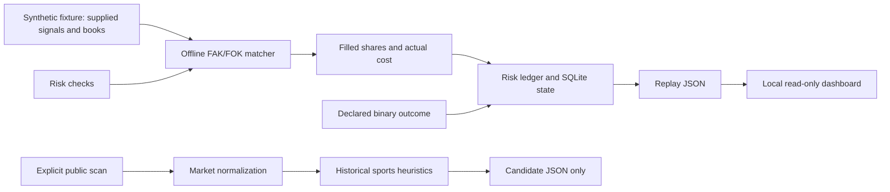

# Architecture

`polymoney.py replay` runs a fresh in-memory ledger. It checks the requested
notional against risk limits, matches supplied depth, records actual filled
shares/cost, settles using the fixture's declared outcome and returns the event
trace. It does not infer the outcome or invoke the historical engines.

`server.py` serves a cached replay result and health endpoint on loopback. It
starts no scanner, trading loop, notifier or market WebSocket. The dashboard
loads its CSS and JavaScript locally and renders text with DOM text nodes.

`polymoney.py scan` is a separate opt-in read-only path. Its HTTP adapter permits
HTTPS GET requests to a fixed public-host allowlist, does not inherit proxy or
`.netrc` credentials and rejects redirects. API failures can produce an empty
result in the legacy scanner; inspect access and API behavior before drawing
conclusions from it.

The selected crypto signal functions preserve the original experimental logic.
Their original entry/exit lifecycle classes depended on the private orchestrator
and were omitted. This source edition has no background strategy dispatcher.

SQLite can be instantiated with an explicit research file path by a caller;
the bundled entrypoints use memory. The recovery test creates only a temporary
synthetic database. Replay refuses a store with existing account state or open
positions, and default configuration does not honor the private runtime's
environment or database path.
